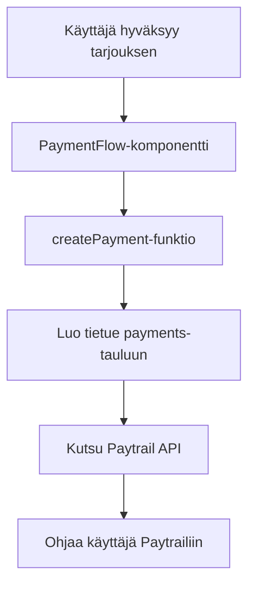

# Paytrail-integraatio - Dokumentaatio

## Yleiskatsaus

TaskMVP käyttää Paytrailia maksujärjestelmänä. Integraatio mahdollistaa turvallisen maksuliikenteen käyttäjien ja tekijöiden välillä.

## Arkkitehtuuri

### Komponentit

1. **Paytrail-palvelu** (`src/services/paytrail.ts`)
   - Alustaa Paytrail-klientin
   - Luo maksupyynnöt
   - Käsittelee vastaukset

2. **PaymentFlow-komponentti** (`src/components/payment/payment-simulation.tsx`)
   - Näyttää maksun yhteenvedon
   - Ohjaa käyttäjän Paytrailiin
   - Sisältää varamekanismin (simulaatio)

3. **Webhook-käsittelijä** (`supabase/functions/paytrail-webhook/index.ts`)
   - Supabase Edge Function
   - Vastaanottaa Paytrailin ilmoitukset
   - Päivittää maksun tilan

4. **Callback API** (`src/app/api/paytrail-callback/route.ts`)
   - Käsittelee käyttäjän paluun Paytrailista
   - Varmistaa allekirjoituksen
   - Päivittää tietokannan

5. **Tietokanta** (`payments`-taulu)
   - Tallentaa kaikki maksutapahtumat
   - Seuraa maksun tilaa
   - Linkittää maksut tehtäviin

## Asennus ja konfigurointi

### 1. Ympäristömuuttujat

Lisää `.env.local`-tiedostoon:

```env
# Paytrail-tunnukset (testaus)
PAYTRAIL_MERCHANT_ID=375917
PAYTRAIL_SECRET_KEY=SAIPPUAKAUPPIAS

# Sovelluksen URL
NEXT_PUBLIC_BASE_URL=https://your-domain.com
```

### 2. Tietokanta

Aja SQL-skripti `sql/create_payments_table.sql`:

```sql
CREATE TABLE IF NOT EXISTS payments (
    id UUID PRIMARY KEY DEFAULT gen_random_uuid(),
    created_at TIMESTAMPTZ NOT NULL DEFAULT now(),
    updated_at TIMESTAMPTZ NOT NULL DEFAULT now(),
    task_id UUID NOT NULL REFERENCES tasks(id) ON DELETE CASCADE,
    user_id UUID NOT NULL REFERENCES auth.users(id) ON DELETE CASCADE,
    amount NUMERIC(10, 2) NOT NULL,
    currency VARCHAR(3) NOT NULL DEFAULT 'EUR',
    status TEXT NOT NULL DEFAULT 'pending',
    paytrail_transaction_id TEXT,
    provider TEXT NOT NULL DEFAULT 'paytrail',
    raw_response JSONB
);
```

Aja myös tilastofunktio `sql/payment_statistics_function.sql`.

### 3. Supabase Edge Function

Deploy webhook-käsittelijä:

```bash
supabase functions deploy paytrail-webhook
```

## Maksuprosessi

### 1. Maksun aloitus



### 2. Maksun käsittely

```mermaid
graph TD
    A[Käyttäjä maksaa Paytrailissa] --> B[Paytrail ohjaa takaisin]
    B --> C[/dashboard/tasks/id?payment=success]
    C --> D[PaytrailReturnHandler]
    D --> E[Näytä onnistumisviesti]
    
    A --> F[Paytrail lähettää webhookin]
    F --> G[Edge Function]
    G --> H[Päivitä maksun tila]
    H --> I[Päivitä tehtävän tila]
```

### 3. Virhetilanteet

Jos Paytrail-integraatio epäonnistuu:
1. Käyttäjälle näytetään virheviesti
2. Tarjotaan mahdollisuus käyttää simulaatiota (vain testaus)
3. Virhe lokitetaan konsoliin

## Testaus

### 1. Testikorttinumerot

Paytrailin testiympäristössä toimivat kortit:
- **4153013999700313** - Onnistuva maksu 3D Securella
- **4153013999700321** - Automaattinen 3D Secure
- **4153013999700354** - Epäonnistuva maksu

### 2. Testaustyökalu

Käytä `/api/test-paytrail`-endpointia tarkistaaksesi integraation tila:

```bash
curl https://your-domain.com/api/test-paytrail
```

Vastaus näyttää:
- Ympäristömuuttujien tilan
- Tietokannan valmiuden
- Paytrail-konfiguraation

## Admin-työkalut

### Maksuhallinta

Admin-paneelissa (`/admin/payments`) voit:
- Nähdä kaikki maksutapahtumat
- Suodattaa maksuja tilan mukaan
- Nähdä maksutilastot
- Tarkastella yksittäisten maksujen tietoja

### Tilastot

Admin-etusivulla näkyy:
- Maksettujen summa yhteensä
- Odottavien maksujen määrä
- Epäonnistuneiden maksujen määrä

## Turvallisuus

1. **Allekirjoitusten varmistus**
   - Kaikki Paytrailin vastaukset varmistetaan HMAC-SHA256-allekirjoituksella
   - Webhook-kutsut tarkistetaan Edge Functionissa

2. **HTTPS-pakotus**
   - Kaikki maksuliikenteeseen liittyvä data kulkee HTTPS:n yli

3. **Ympäristömuuttujat**
   - API-avaimet säilytetään ympäristömuuttujissa
   - Ei koskaan commitoida versionhallintaan

## Ylläpito

### Lokien seuranta

Seuraa seuraavia lokeja ongelmatilanteissa:
- Browser console (client-side virheet)
- Vercel Functions logs (API-virheet)
- Supabase Edge Functions logs (webhook-virheet)

### Yleisimmät ongelmat

1. **"Maksulinkin luonti epäonnistui"**
   - Tarkista API-avaimet
   - Varmista, että BASE_URL on oikein

2. **Webhook ei päivitä maksun tilaa**
   - Tarkista Edge Function -lokit
   - Varmista, että webhook URL on oikein Paytrailissa

3. **Käyttäjä ei pääse takaisin maksun jälkeen**
   - Tarkista redirect URL:t
   - Varmista, että PaytrailReturnHandler on sivulla

## Tuotantoon siirtyminen

1. **Hanki tuotannon API-avaimet** Paytrailista
2. **Päivitä ympäristömuuttujat** tuotantoympäristössä
3. **Testaa kaikki maksuprosessit** tuotantoympäristössä
4. **Konfiguroi webhookit** Paytrailin hallintapaneelissa
5. **Seuraa ensimmäisiä maksuja** tarkasti

## Yhteystiedot

Paytrail-tuki:
- Email: asiakaspalvelu@paytrail.com
- Puhelin: 0290 010 203
- Kehittäjädokumentaatio: https://docs.paytrail.com/ 